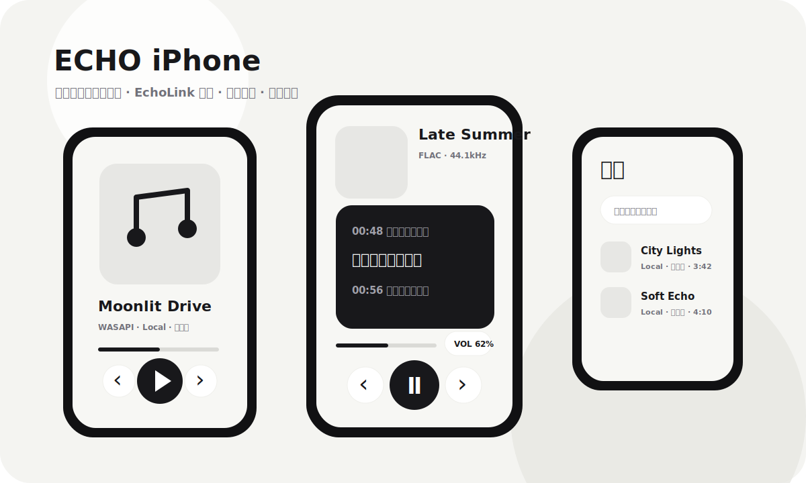

<p align="center">
  
</p>

<h1 align="center">ECHO iPhone</h1>

<p align="center">
  An iPhone music-player companion for <a href="https://github.com/Moekotori/ECHO">ECHO NEXT</a>.
</p>

<p align="center">
  <strong>English</strong> · <a href="README.md">中文</a> · <a href="RELEASE_NOTES.md">Release Notes</a>
</p>



> This is an unofficial community project and is not maintained by the official ECHO NEXT project.

## What It Is

ECHO iPhone turns an iPhone into a lightweight music-player client for the ECHO NEXT desktop app. It connects through EchoLink, browses the PC library, controls playback, shows live status, and can stream supported PC tracks to the phone.

The interface aims for a calm gray/white player aesthetic: centered artwork in normal mode, a compact lyrics mode, liquid-glass dock, glassy controls, and swipeable page navigation.

## Features

- EchoLink pairing URI and manual LAN connection.
- Three pages: Playback, Library, and Connection.
- Swipe between pages and use the bottom dock.
- Gaussian glass style controls powered by `expo-blur`.
- Live playback status, title, progress, volume, and queue refresh.
- Draggable progress and volume controls.
- Expandable mini volume slider in lyrics mode.
- Previous, play/pause, next.
- Real repeat-one behavior on the client side.
- Queue preview popover.
- Library search and PC playback entry.
- Artwork loading with fallback.
- Lyrics panel with `/lyrics`, LRC parsing, active line highlight, and tap-to-seek for timestamped lyrics.
- Control/stream output switch.
- Optional metadata tags when EchoLink provides them.

## Requirements

- Node.js and npm
- Expo through `npx expo`
- macOS + Xcode for local iOS builds, or GitHub Actions for unsigned IPA artifacts
- ECHO NEXT desktop with EchoLink enabled
- Sideloadly, AltStore, Xcode, or another signing/install path for real-device testing

## Run Locally

```powershell
npm install
npm run start
```

Type check:

```powershell
npm run typecheck
```

iOS export check:

```powershell
npx expo export --platform ios --output-dir build\export-check
```

## Connect To ECHO NEXT

Pairing URI example:

```text
echo://pair?host=192.168.1.12&port=26789&token=...
```

Manual fields:

- Host: PC LAN IP, for example `192.168.2.27`
- Port: usually `26789`
- Token: copied from the desktop EchoLink pairing screen

If connection fails, check LAN, firewall, EchoLink status, host IP, and iOS local network permission.

## Build Unsigned IPA

Windows can trigger the workflow, but actual iOS packaging requires a macOS/Xcode runner.

1. Push this repo to GitHub.
2. Run `Build iOS unsigned IPA` in GitHub Actions.
3. Download the `ECHO-iPhone-unsigned-ipa` artifact.
4. Sign/install with Sideloadly, AltStore, Xcode, or another tool.

Local Mac:

```bash
bash scripts/build-unsigned-ipa-for-sideloadly.sh
```

## Release Notes

See [RELEASE_NOTES.md](RELEASE_NOTES.md).
